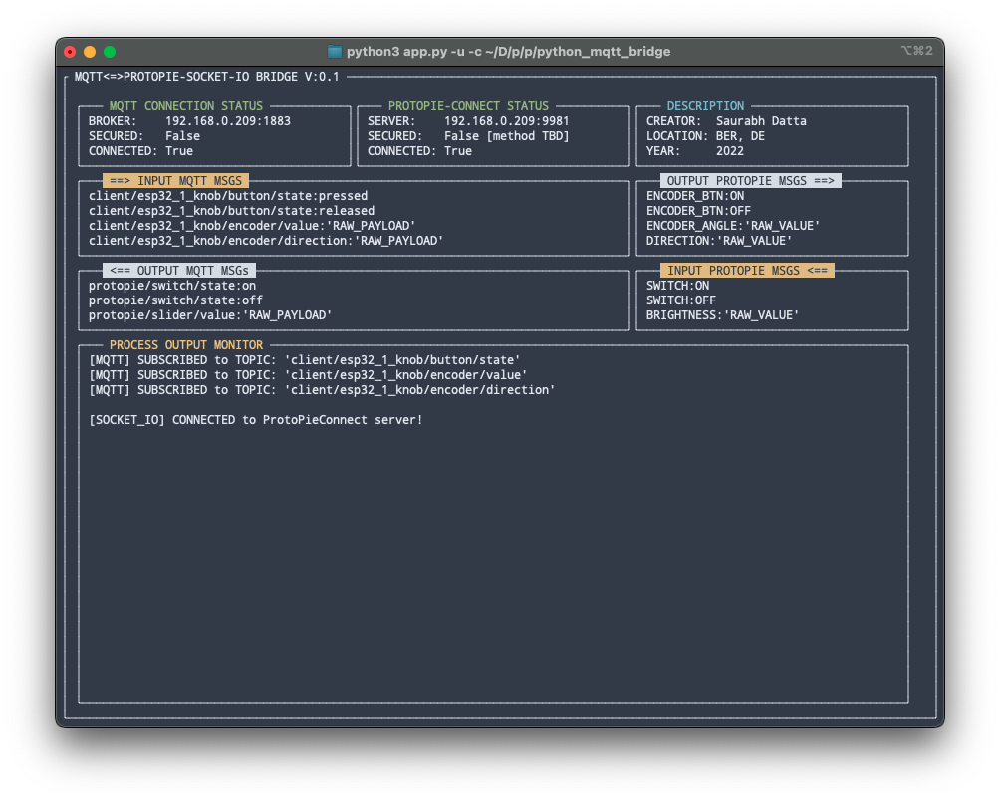

# README

## Why?

1. You might be working with a system where you need to translate between mqtt messages and protopie socketio messages, especially to work with a/multiple hardware and software based systems where there are many prototypes and where rest of the architechture speaks **mqtt** and not socketio. ([benefits of using mqtt](https://www.neovasolutions.com/2020/07/03/what-is-mqtt-protocol-and-how-does-it-work/)).
2. **ProtoPieConnect Desktop** doesn't have a already pre-existing choice to choose between mqtt or socketio and communication protocol.
3. **ProtoPieConnect Embedded** can be launched with `--mqtt` flag set to `true` but the port is default port `1883`.
4. One might want to change the default mqtt port, according to their needs, and according to the rest of the system and also apply other mqtt customization attributes.

## Before moving forward

1. Make sure you have a mqtt broker running on a machine (e.g.: make sure you have [mosquitto](https://mosquitto.org/download/) installed and then run: `mosquitto -v -p <a port>`)
2. In the `config.yaml`, change the value for `mqtt_broker_host` and `mqtt_broker_port` to the IP address of the machine and the port you are using, respectively.
3. Make sure that [ProtoPieConnect Desktop or ProtoPieConnect Embedded](https://protopie.notion.site/Desktop-vs-Embedded-6f1de40dc2e644df9f85dc3bad81367c) is running on a machine (on the same network).
4. If you are using a secure mqtt broker, which requires a username and pwd for authentication, create a .env file and put the following data in it.

    ```shell
    vim .env

    # in .env
    MQTT_USR='<USERNAME USED TO SECURE THE MOSQUITTO BROKER>'
    MQTT_PWD='<PASSWORD USED TO SECURE THE MOSQUITTO BROKER>'
    ```

    > They are intentionally de-coupled from the `config.yaml` for security reasons. <br>
    [How to configure a mosquitto broker with username and password](https://gist.github.com/dattasaurabh82/c175aa913345cca64db55cb6983aebb9)?

    Also in the `config.yaml`, the, set `mqtt_secured: true`
    > If you do not intend to use secure MQTT, set `mqtt_secured: false`
5. In the `config.yaml`, change the value for `protopie_host` to the he IP address of the machine where ProtoPieConnect is running from.
6. For ProtoPieConnect Embedded, you can assign a custom port and ip address when launching the binary by:

    ```shell
   ./<connect_bin> --ip <custom ip> --port <custom port>
   ./<connect_bin> --port 9981 # 9981 is the proto pie connect's default port used through out the system. 
   ```

## How are the relations between MQTT messages and ppConnect's socktio messages defined?

Without touching the code/script.
> Explanation TBD

## Running the script/application

Activate the virtual environment first:

1. For bash:

   ```bash
   source <Cloned Project DIR/py_pie_mqtt_bridge/bin/activate
   ```

2. For fish:

    ```bash
    source <Cloned Project DIR/py_pie_mqtt_bridge/bin/activate.fish
    ```

etc.

> If you have just git cloned it and your shell is default bash, then by default, the venv activation cmd would be:
>
 >   ```bash
 >   source protopie_py_bridge_examples/py_pie_mqtt_bridge/bin/activate
 >   ```

```shell
$ python3 app.py --help
usage: app.py [-h] [-c] [-s] [-u] [-m] [-a]

Start the script in 'pure command line mode' or in 'TUI mode'

options:
  -h, --help      show this help message and exit
  -c , --config   path for the config file
  -s, --script    launch in script mode
  -u, --tui       launch in text ui mode
  -m, --showmap   during launch, first show the logical mapping of data between MQTT & SOCKETIO
  -a, --auto      doesn't ask for prompt to proceed after launching the script
```

> If only `python3 app.py` is issued, then by default, it would launch in script mode, use the config.yaml as the config file from the scripts's directory and will ask for a prompt to launch.

Now, the script can run in 2 modes:

1. **Script Mode.**


```bash
# Explicitely telling to launch in script mode, using default config file from the script directory
python3 app.py --script
python3 app.py -s # short-hand arg

# Explicitely telling to launch in script mode, using custom config file PATH
python3 app.py --script --config <path_to_custom_config.yaml>
python3 app.py -s -c <path_to_custom_config.yaml> # short-hand arg

# Explicitely telling to launch in script mode and show the relationship between MQTT messages and the socketio messages (drawn from default config file)
python3 app.py --script --showmap
python3 app.py -s -m # short-hand arg

# Explicitely telling to launch in script mode and show the relationship between MQTT messages and the socketio messages (drawn from supplied, custom config file PATH), but do not ask for prompt (which is usually there for giving the user time to look at the relationship map)
python3 app.py --script --config <path_to_custom_config.yaml> --auto
python3 app.py -s -c <path_to_custom_config.yaml> -a
```

2. **Text User Interface (TUI) Mode.**



```bash
# Explicitely telling to launch in TUI mode, using default config file from the script directory
python3 app.py --tui
python3 app.py -u # short-hand arg

# Explicitely telling to launch in TUI mode, using custom config file PATH
python3 app.py --tui --config <path_to_custom_config.yaml>
python3 app.py -u -c <path_to_custom_config.yaml> # short-hand arg

# Explicitely telling to launch in TUI mode and show the relationship between MQTT messages and the socketio messages (drawn from default config file)
python3 app.py --tui --showmap
python3 app.py -u -m # short-hand arg

# Explicitely telling to launch in TUI mode and show the relationship between MQTT messages and the socketio messages (drawn from supplied, custom config file PATH), but do not ask for prompt (which is usually there for giving the user time to look at the relationship map)
python3 app.py --tui --config <path_to_custom_config.yaml> --auto
python3 app.py -u -c <path_to_custom_config.yaml> -a
```

---

## TODO

- [x] Modularize the whole script set.
- [x] Lint.
- [x] Generalize `mqtt -> socketio` translation layer's business logic through a config file.
- [x] Generalize `socketio -> mqtt` translation layer's business logic through a config file.
- [x] Handle unintended messages in sockeio client.
- [x] Clean exit method of `'ctrl-c'` (Solve: kill threads when exiting in a clean fashion.)
- [x] If similar mqtt topics in config file, subscribe only once.
- [x] Apply MQTT security selection options for users.
- [x] Add a TUI mode.
- [x] Add arg to supply a config file path.
- [x] Method to run the app/script from being in any dir (resolve default config file dependency).
- [ ] Apply MQTT ssl/tls support options for users.
